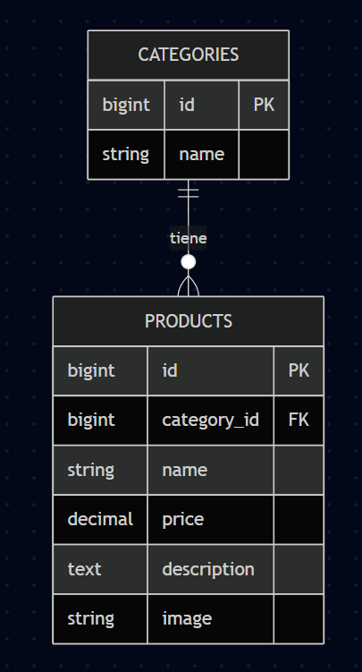

# Diseño de la Base de Datos - CookFlow

**Nombre de la BBDD:** `cookflow_db`  
**Diseño realizado por:** Luis

Este documento describe la arquitectura relacional completa del sistema CookFlow, incluyendo la gestión de menú, usuarios, infraestructura de sala (mesas) y el flujo de pedidos.

## 📊 Diagrama Entidad-Relación
El sistema se basa en un núcleo relacional donde el **Pedido (Order)** actúa como nexo entre el personal, las mesas y los productos.

## 🛠 Estructura de las Tablas

### 1. Usuarios (`users`)
Gestiona el acceso y los roles del personal.
* `id`: PK.
* `name`: Nombre completo.
* `email`: Correo único (login).
* `role`: 'admin' o 'waiter' (camarero).
* `password`: Hash de seguridad.

### 2. Infraestructura de Sala (`tables`)
Representación física del restaurante.
* `id`: PK.
* `number`: Número de mesa único.
* `capacity`: Aforo máximo de la mesa.
* `status`: Estado actual ('free', 'occupied', 'pending').
> **Campos Virtuales (API):** El sistema añade `qr_url` (generado dinámicamente) y `active_order` (relación calculada) al consultar este recurso.

### 3. Gestión de Menú (`categories` & `products`)
* **Categories**: `id` (PK), `name` (ej: Carnes), `slug` (URL única).
* **Products**: `id` (PK), `name`, `price` (Decimal 8,2)->Precio unitario del catálogo, `description`, `image`, `category_id` (FK).

### 4. Flujo de Pedidos (`orders` & `order_items`)
* **Orders**: Registro del servicio.
    * `id`: PK.
    * `table_id`: FK hacia `tables`(onDelete: cascade).
    * `waiter_id`: FK hacia `users`(onDelete: cascade).
    * `status`: Estado del pedido ('pending', 'preparing', 'served', 'paid').
    * `total_price`: Decimal (10,2). Suma total calculada de forma segura en el backend.
* **Order_Items**: Detalle de cada línea del pedido (Tabla pivote con datos extra).
    * `id`: PK.
    * `order_id`: FK hacia `orders`.
    * `product_id`: FK hacia `products`.
    * `quantity`: Cantidad pedida.
    * `unit_price`: Precio en el momento del pedido.
    * `notes`: Modificaciones (ej: "Sin cebolla").

## 🔗 Relaciones Principales
1. **1:N (Category -> Products):** Una categoría agrupa varios productos.
2. **1:N (Table -> Orders):** Una mesa puede tener muchos pedidos a lo largo del tiempo, pero un pedido pertenece a una mesa.
3. **1:N (User -> Orders):** Un camarero gestiona múltiples pedidos.
4. **1:N (Order -> Order_Items):** Un pedido se desglosa en múltiples líneas de productos.